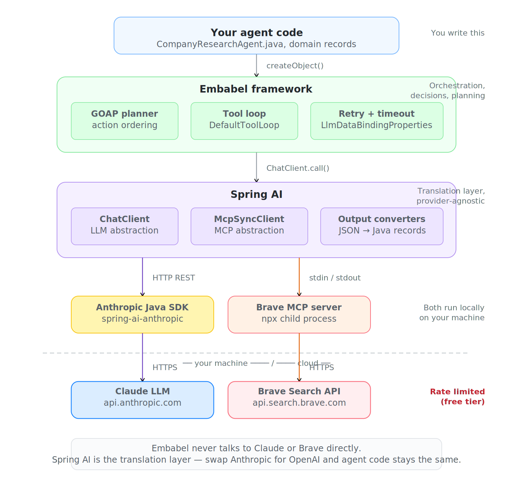

# Embabel Agentic Framework

A hands-on exploration of the [Embabel](https://github.com/embabel/embabel-agent) agentic AI framework (v0.3.5). This project contains two agents that demonstrate GOAP-based planning, typed domain models, LLM-powered actions, and MCP tool integration with Brave Search.

Embabel is a JVM-based agentic framework by Rod Johnson (creator of Spring Framework). It sits on top of Spring AI and uses Goal-Oriented Action Planning (GOAP) to automatically sequence actions based on Java type signatures — you define what each action consumes and produces, and the planner figures out the execution order.

## Agents

### 1. Job application reviewer (no external tools)

Takes a free-text job application (resume + job description) and produces a fit report.

**GOAP plan:** `UserInput → JobApplication → SkillAnalysis → FitReport`

Each step is an `@Action` method that takes a typed input and returns a typed output. The planner infers the chain from the type signatures automatically.

### 2. Company research agent (with Brave Search MCP)

Takes a natural language query like "Research Personio for my Senior Java Developer interview" and produces a structured interview preparation brief using live web search.

**GOAP plan:** `UserInput → CompanyQuery → CompanyProfile → InterviewBrief`

The `researchCompany` action uses `.withToolGroup(CoreToolGroups.WEB)` to give the LLM access to Brave Search tools during its reasoning. The LLM decides when and what to search within a tool loop — Embabel orchestrates the back-and-forth between the LLM and the MCP server.

## Project structure

```
src/main/java/com/example/agent/
├── EmbabelDemoApplication.java        # @SpringBootApplication + @EnableAgents
├── agent/
│   ├── JobApplicationReviewerAgent.java   # 3 actions, no tools
│   └── CompanyResearchAgent.java          # 3 actions, uses Brave MCP
├── config/
│   └── WebToolGroupConfig.java            # Maps MCP tools to Embabel's "web" role
└── model/
    ├── JobApplication.java                # record: candidateName, skills, experience...
    ├── SkillAnalysis.java                 # record: matchedSkills, gaps, score...
    ├── FitReport.java                     # record: recommendation, summary...
    ├── CompanyQuery.java                  # record: companyName, targetRole
    ├── CompanyProfile.java                # record: techStack, products, recentNews...
    └── InterviewBrief.java                # record: openingPitch, questionsToAsk...
```

## Prerequisites

- Java 21+ (project uses Java records and virtual threads)
- Maven 3.9+
- Node.js 18+ and npm (for the Brave MCP server, which runs as an npx child process)
- Anthropic API key (free tier works, but has rate limits)
- Brave Search API key (free tier: 2,000 queries/month — get one at https://brave.com/search/api/)

## Setup

### 1. Get API keys

**Anthropic:** Sign up at https://console.anthropic.com and create an API key.

**Brave Search:** Sign up at https://brave.com/search/api/, create a free plan, and copy the API key.

### 2. Set environment variables

Add these to your `~/.zshrc` (or `~/.bashrc`):

```bash
export ANTHROPIC_API_KEY=sk-ant-...
export BRAVE_API_KEY=BSA...
```

Then reload: `source ~/.zshrc`

### 3. Verify npx path

The MCP config needs the full path to `npx`. Find it with:

```bash
which npx
```

If it's not `/usr/local/bin/npx`, update the `command` field in `application.yml`.

### 4. Build and run

```bash
mvn clean package -DskipTests
mvn spring-boot:run
```

You should see the Embabel banner, followed by:

```
MCP server starting.
MCP server started
Found 1 clients: Implementation[name=brave-search-mcp-server, ...]
Deployed agent CompanyResearchAgent
Deployed agent JobApplicationReviewerAgent
Current LLM settings: maxAttempts=3, fixedBackoffMillis=30ms, timeout=120s
```

## Usage

The app starts an interactive shell. Use the `x` command to run queries:

### Company research (with web search)

```
embabel> x "Research <COMPANY NAME> for my Senior Java Developer interview"
```

This triggers the full GOAP pipeline: parse query → web research (3 Brave searches) → generate interview brief. Takes about 60-90 seconds. Output includes company summary, tech stack, talking points, questions to ask, and an opening pitch.

### Job application review

```
embabel> x "Job: Senior Java Developer at a fintech. Requirements: Java 17+, Spring Boot, microservices, Kafka, PostgreSQL. Candidate: 10 years Java experience, Spring Boot expert, worked on payment systems at Visa, knows Kafka and Redis, no PostgreSQL experience."
```

### Other shell commands

```
embabel> tools          # List registered tool groups (should show: AppleScript, math, web)
embabel> agents         # List deployed agents
```

## Architecture



## Rate limiting notes

On Anthropic's free tier, the company research agent can hit rate limits if the LLM makes too many searches. Three configuration changes address this:

- **Prompt constraint** ("Limit to 3 searches max") — reduces the number of tool loop iterations, which reduces API calls. This is the most impactful fix.
- **`max-attempts: 3`** (down from default 10) — limits retry cascading. Each retry restarts the full tool loop, so 10 retries × 4 iterations = 40+ API calls competing for the same rate limit window.
- **`default-timeout: 120s`** (up from default 60s) — prevents premature timeouts from triggering unnecessary retries.